# µsini Diagrams
by [µsini](https://twitter/m4dnerd)

✔️ All diagrams are free to use without attribution (Public Domain)   
❌ Diagrams are not up-to-scale   

# 📥 [Download](https://github.com/usini/diagrams/archive/master.zip) 
# ❓ Need a diagram ? --> https://github.com/usini/issues
# 

# Table of Contents
- [Table of Contents](#table-of-contents)
- [Audio](#Audio)
- [Boards](#Boards)
- [Communication](#Communication)
- [Controls](#Controls)
- [Displays](#Displays)
- [Icons](#Icons)
- [Motor](#Motor)
- [PowerSupply](#PowerSupply)
- [Sensors](#Sensors)
- [Storage](#Storage)
- [Tools](#Tools)
# Audio
### audio_buzzer.svg
 
### audio_dac_I2S_gy_pcm5102.svg
 

 #### [TOP](#table-of-contents) 
# Boards

### cheap_yellow_display.svg

### prototyping_board_90_70mm.svg
 
### raspberrypi_zero.svg
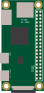 
### seeeduino_xiao.svg
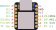 
## Boards/arduino
### arduino_mkrwan1300.svg
 
### arduino_uno.svg
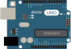 
### atmegazero.svg
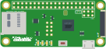 
### bsfrance_lora32u4.svg
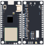 
### digispark_tiny85.svg
 
### pro_micro.svg
 
### robotdyn_nano_micro_usb.svg
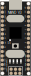 
## Boards/esp32
### doit_esp32.svg
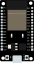 
### wemos_esp32_lite.svg
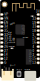 
### wemos_lolin32.svg
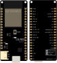 
### wemos_lolin_D32.svg
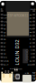 
### wemos_lolin_D32_pro.svg
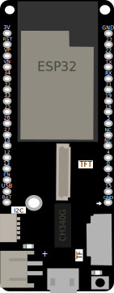 
## Boards/esp8266
### wemos_D1_mini.svg
 
### wemos_mini_pro.svg
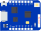 

 #### [TOP](#table-of-contents) 
# Communication
### bluetooth_hc06.svg
 
### ethernet_WIZ550io_ver1_0.svg
 
## Communication/ir
### infrared_tsop4836.svg
 
### infrared_vs1838b.svg
 
## Communication/radio
### 433Mhz_ask433_transmitter.svg
 
### 433Mhz_radio_receiver_rbx6_ask_superheterodyne.svg
 
### nrf24l01.svg
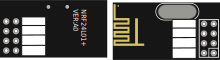 
### rfm69.svg
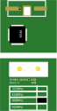 
### rfm95.svg
 

 #### [TOP](#table-of-contents) 
# Controls
### potentiometer.svg
 
### relay_12v.svg
 
### rfid_rc522.svg
 
### switch_spdt_slide.svg
 
## Controls/buttons
### button_silicone_8mm.svg
 
### keypad_16keys.svg
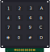 
### veroboard_4buttons_12mm.svg
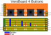 
## Controls/touch
### touch_16keys_ttp229.svg
 
### touch_1keys_ttp223.svg
 
### touch_4keys_ttp224.svg
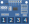 
## Controls/usbhost
### usbhost_mini.svg
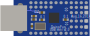 
### usbhost_mini_arduinomini.svg
 
### usbhost_mini_def.svg
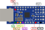 
### usbhost_mini_esp32.svg
 
### usbhost_mini_micro.svg
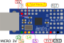 
### usbhost_mini_wemosmini.svg
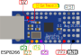 

 #### [TOP](#table-of-contents) 
# Displays
### oled_0.91_128x32.svg
 
### vibration_motor_open_smart.svg
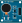 
## Displays/lcd
### lcd_16x2_with_i2c.svg
 
### lcd_adafruit_I2C_16x2_rgb_pi_plate.svg
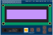 
## Displays/leds
### led.svg
 
### led_ws2812b_strip.svg
 
## Displays/tft
### tft_1.3_st7789.svg
 
### tft_1.45_lcd.svg
 
### tft_2.2_lcd_display_hat.svg
 
### tft__st7789_wemos_mini.svg
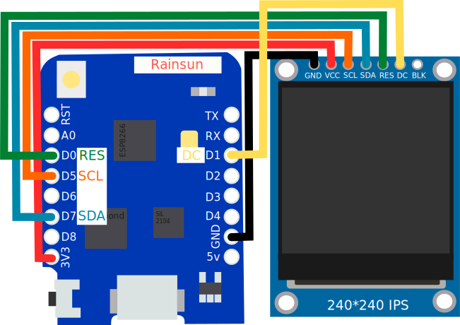 

 #### [TOP](#table-of-contents) 
# Icons
### icon-base.svg
 
### icon-communication.svg
 
### icon-control.svg
 
### icon-display.svg
 
### icon-powersupply.svg
 
### icon-storage.svg
 
### icons.svg
 
### logo_others.svg
 
## Icons/sensors
### icon-sensor-baro.svg
 
### icon-sensor-door.svg
 
### icon-sensor-gyro.svg
 
### icon-sensor-light.svg
 
### icon-sensor-presence.svg
 
### icon-sensor-temp-hum.svg
 
### icon-sensor-temp.svg
 
### icon-sensor-time.svg
 
### icon-sensor-water.svg
 
### icon-sensor-weight.svg
 
### icon-sensor.svg
 

 #### [TOP](#table-of-contents) 
# Motor
### dc_motor.svg
 
### pca9685.svg
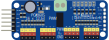 
### servo_ideaw_mg995.svg
 

 #### [TOP](#table-of-contents) 
# PowerSupply
### battery_lithium_ion_2000mah.svg
 
### battery_lithium_ion_500mah.svg
 
### charger_adafruit_powerboost_1000c.svg
 
### connector_micro_JST_2.0.svg
 
### level_converter.svg
 
### solar_panel.svg
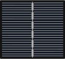 

 #### [TOP](#table-of-contents) 
# Sensors
### distance_hcsr04.svg
 
### mpr121.svg
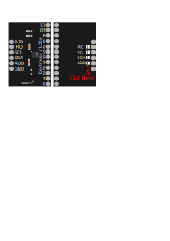 
### multiplexer_i2c_tca9548A.svg
 
### polulu_vl6180.svg
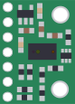 
### water_sensor.svg
 
### weight_sensor_hx711.svg
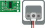 
## Sensors/accelerometer
### accelerometer_3_Axis_ADXL345.svg
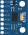 
### accelerometer_9_Axis_gyro__magnetometer_mpu_9250.svg
 
## Sensors/clock
### clock_ds3231.svg
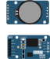 
### clock_ds3231_for_pi.svg
 
### clock_tinyrtc_I2C_modules.svg
 
## Sensors/light
### light_photoresistor.svg
 
### light_tsl2561.svg
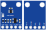 
## Sensors/presence
### presence_hc_sr501_pir.svg
 
### presence_keyes_pir.svg
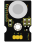 
### presence_rcwl_0516.svg
 
### presence_reed_switch.svg
 
## Sensors/temperature
### temperature_altimeter_barometric_adafruit_mpl3115A2.svg
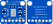 
### temperature_ds18b20.svg
 
### temperature_humidity_barometric_bmpe280.svg
 
### temperature_humidity_dht11.svg
 
### temperature_humidity_si7021.svg
 
### temperature_humidity_sparkfun_si7021.svg
 
### temperature_tmp36.svg
 
### temperature__humidity_barometric_gaz_bme680.svg
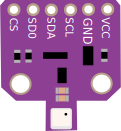 

 #### [TOP](#table-of-contents) 
# Storage
### 16GB_MICRO_SD_CARD.svg
 
### mini_usb_drive_32_go.svg
 
### sd_card_slot.svg
 

 #### [TOP](#table-of-contents) 
# Tools
### 3D_PRINTER.svg
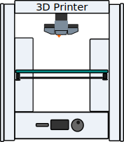 
### AWG_30_WRAPPING_CABLE.svg
 
### GLUE_GUN.svg
 
### SOLDERING_IRON.svg
 
### UCURRENT_GOLD.svg
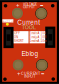 
### WIRE_CUTTER.svg
 
### KNIFE.svg

### hotair_gun.svg

### Flux_Paste.svg

### tweezers.svg

 
 #### [TOP](#table-of-contents) 
 
